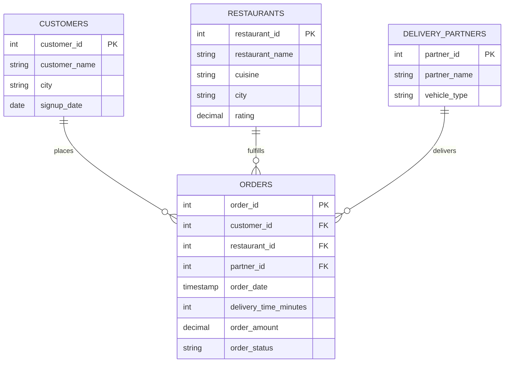

# 🍔 Food Delivery Analytics — SQL Portfolio Project

An end-to-end SQL analytics project simulating the kind of order, delivery, and
restaurant-performance analysis a Data Analyst would run at a company like
**Swiggy, Zomato, Uber Eats, or DoorDash**.

The project covers order & revenue analysis, delivery performance, restaurant
performance, customer behavior, and delivery-partner efficiency — using CTEs,
window functions, and date/time functions in SQL.

---

## 📌 Business Objectives

- Analyze food orders and revenue
- Measure delivery performance
- Evaluate restaurant performance
- Analyze customer ordering behavior
- Track delivery partner efficiency
- Identify peak order hours
- Reduce delivery delays
- Improve customer satisfaction

---

## 🗂️ Dataset

Synthetic data generated to resemble real food-delivery operations:

| Table | Rows | Description |
|---|---|---|
| `customers` | 25 | Customer profile + signup city/date |
| `restaurants` | 12 | Restaurant name, cuisine, city, rating |
| `delivery_partners` | 10 | Rider name + vehicle type |
| `orders` | 359 | Feb–Apr 2025, linked to customer/restaurant/partner |

Order statuses: `Delivered`, `Delayed`, `Cancelled`
(`Delivered` ≈ 82%, `Delayed` ≈ 12%, `Cancelled` ≈ 6%)

---

## 🧩 Entity Relationship Diagram



---

## 📁 Project Structure

```
food-delivery-analytics-sql/
├── schema.sql            -- database & table definitions
├── seed_data.sql          -- 25 customers, 12 restaurants, 10 partners, 359 orders
├── analysis_queries.sql   -- 24+ business KPI queries (CTEs + window functions)
└── README.md
```

---

## ▶️ How to Run

```bash
mysql -u root -p < schema.sql
mysql -u root -p food_delivery_db < seed_data.sql
mysql -u root -p food_delivery_db < analysis_queries.sql
```

(Compatible with MySQL 8.0+; works on PostgreSQL with minor function name
changes — `HOUR()` → `EXTRACT(HOUR FROM ...)`, `DATE_FORMAT()` → `TO_CHAR()`.)

---

## 📊 KPIs Covered

Total Orders • Total Revenue • Average Order Value • Average Delivery Time •
On-Time Delivery Rate • Delayed Delivery Rate • Orders by Hour • Peak Ordering
Hour • Orders by Day of Week • Revenue by Restaurant • Revenue by City •
Top 10 Restaurants • Top Customers by Spending • Average Restaurant Rating •
Delivery Partner Performance • Average Orders per Partner • Highest Revenue
Cuisine • Customer Retention Rate • Repeat Order Rate • Cancellation Rate •
Delivery Time by City • Delivery Time by Cuisine • Revenue Trend (Daily &
Monthly) • Restaurant Market Share • Customer Lifetime Value (CLV)

---

## 🔎 Key Insights (from the sample dataset)

- **Total revenue** across the Feb–Apr 2025 window: **₹2,69,610**, from 359 orders
  at an **average order value of ₹802**.
- **On-time delivery rate is 87.5%**, with delayed orders taking noticeably
  longer — a clear lever for reducing customer complaints.
- **Cancellation rate sits at 6.4%** — worth root-causing by restaurant and city.
- **Peak ordering hours are 2 PM (lunch) and 8–9 PM (dinner)**, suggesting
  staffing and rider allocation should flex around these windows.
- **Japanese cuisine generated the highest revenue** of any cuisine category
  despite fewer restaurants, indicating strong average order value in that segment.
- A small set of top restaurants (e.g. Noodle Bar, Spice Villa, Curry Kingdom)
  account for a disproportionate share of total revenue — a market-share query
  (`analysis_queries.sql`, KPI #24) quantifies this concentration.

---

## 🛠️ SQL Techniques Used

- Multi-table `JOIN`s across customers, restaurants, partners, and orders
- `CTE`s (`WITH` clauses) for retention, repeat-order, and market-share logic
- Window functions (`SUM() OVER()`, `RANK() OVER (PARTITION BY ...)`)
- Conditional aggregation (`CASE WHEN` inside `SUM`/`COUNT`)
- Date/time functions (`HOUR()`, `DAYNAME()`, `DATE_FORMAT()`)

---

## 🎯 Why This Project

This project simulates the SQL work performed by Data Analysts at food-delivery
and quick-commerce companies — order/revenue reporting, delivery SLA tracking,
restaurant performance ranking, and customer segmentation — making it a solid
portfolio piece for analytics interviews.

---

## 👤 Author

Built by **Himanshu** — B.Tech CSE student, aspiring Data Analyst.
📫 Open to feedback and collaboration — feel free to fork and extend!
